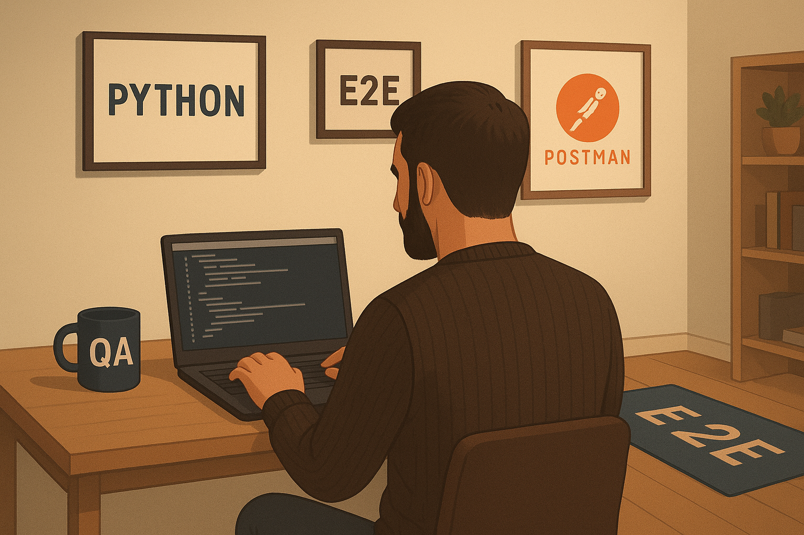

  

<h1 align="center">Hi, I'm Matías Tripodi 👨‍💻</h1>

  <strong>QA Automation Engineer | Python & Java | Strategic Thinker | Bilingual Communicator</strong> 
  <a href="https://www.linkedin.com/in/matias-tripodi-139925a0/">🔗 LinkedIn</a> |
  <a href="https://github.com/matitripodi">🐙 GitHub</a>

---

<h2>🧠 About Me</h2>

I'm a pragmatic and strategic QA Automation Engineer based in Argentina, passionate about building modular, real-world testing labs. I specialize in UI and API automation using <strong>Python (Pytest, Playwright, Selenium)</strong> and <strong>Java (JUnit, Rest Assured)</strong>, with a strong focus on documentation, CI integration, and professional polish.

I thrive on systems thinking, bilingual communication, and continuous improvement—both technically and linguistically. Whether it's refining a test suite, curating a cheat sheet, or optimizing workflows, I approach every challenge with curiosity, persistence, and care.

---

<h2>🧰 Technical Skills</h2>
<ul>
  <li>✅ UI Automation: Playwright, Selenium</li>
  <li>✅ API Testing: Rest Assured, Postman</li>
  <li>✅ Frameworks: Pytest, JUnit, Gradle, Maven</li>
  <li>✅ CI/CD: GitHub Actions, modular documentation</li>
  <li>✅ Issue Tracking: Jira, Trello, GitHub Projects</li>
  <li>✅ Troubleshooting: Windows systems, PowerShell, services</li>
  <li>✅ Communication: Fluent in Spanish and English</li>
</ul>

---

<h2>🏦 Domain Expertise</h2>
<ul>
  <li>💳 3+ years of manual QA experience in critical banking systems</li>
  <li>🔐 Familiar with secure transaction flows, authentication, and error handling</li>
  <li>📈 Understands the importance of precision, auditability, and compliance in financial products</li>
</ul>

---

<h2>🎯 Current Goals</h2>
<ul>
  <li>📌 Expand API test coverage with Rest Assured</li>
  <li>📌 Publish fixed-price QA service packages for freelance platforms</li>
  <li>📌 Refine and share professional cheat sheets for QA workflows</li>
  <li>📌 Integrate technical English practice into daily routines</li>
</ul>

---

<h2>🤝 Let's Connect</h2>

I'm open to collaboration on testing, documentation, and automation projects. If you're looking for a strategic QA partner or want to explore how I can help improve your software quality, feel free to reach out via <a href="https://www.linkedin.com/in/matias-tripodi-139925a0/">LinkedIn</a> or check out my public repositories.

<em>Thanks for stopping by!</em>

